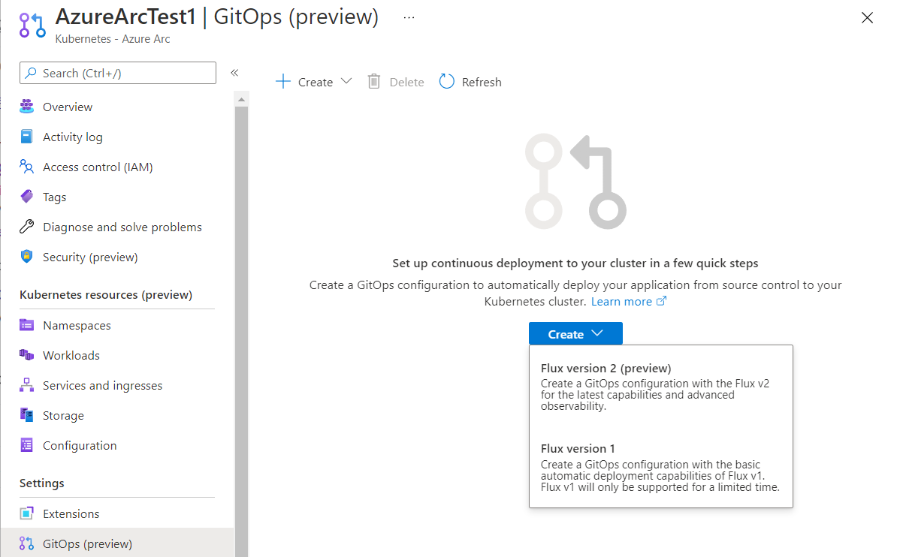
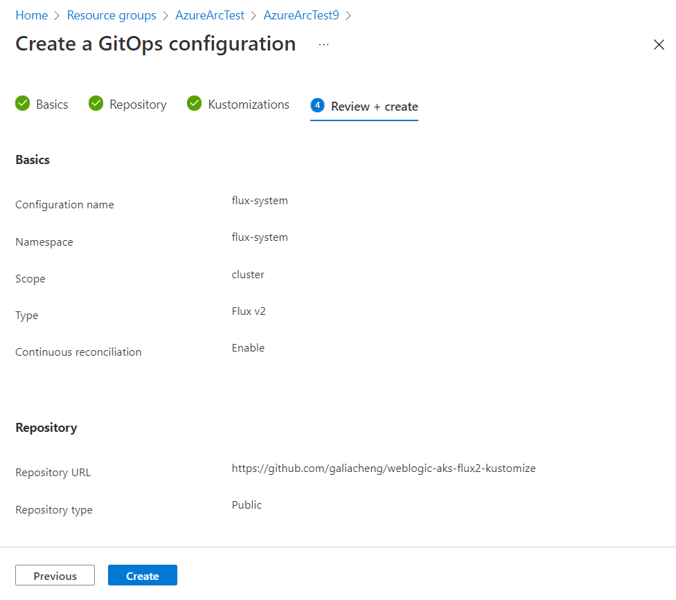

# Use Gitops to run Oracle WebLogic Server on Azure Azure Arc-enabled Kubernetes

This sample is using Flux and Kustomize to create and manage Oracle WebLogic Cluster on Azure Kubernetes Service cluster automatically.

This document guides you to set up GitOps with Flux v2 in Azure Arc-enabled Kubernetes to run and manage the sample Oracle WebLogic Server cluster.

## Prerequisites

- An Azure Arc-enabled Kubernetes connected cluster that's up and running. See [Azure Arc-enabled Kubernetes](https://docs.microsoft.com/en-us/azure/azure-arc/kubernetes/) for more information.
 
## Create GitOps from Azure portal

You are able to create the GitOps using the Azure portal.

- Open your Azure Arc cluster, and click **Settings** -> **GitOps** -> **Create** -> Select **Flux version 2**

    

- **Basics**
  - **Configurations name**: `flux-system`
    
  - **Operator Details**: configuration for Flux operator
    - **Namespace**: `flux-system`, to keep the sample with Flux CLI.
    - **Scope**: `Cluster`

- **Repository**
  - **Repository**
    - **Repository URL**: `https://github.com/galiacheng/weblogic-aks-flux2-kustomize`
    - **Reference type**: `Branch`
    - **Branch**: `main`
  - **Authentication**
    - **Repository type**: `Public`

- **Kustomization**
  - Click **Create**
    - **Path**: `clusters/onpremises`
    - **Prune**: `true`
    - Click **Save**
- Click **Review + create**, you should find the information listed like:

    

Note that if you want to specify your own **Configurations name**, please fork this repository, change `sourceRef.name` in those files and push them to your fork, specify the **Repository URL** with your fork URL: 
  - ingress-kustomization.yaml
  - wko-kustomization.yaml
  - wls-kustomization.yaml.

The GitOps extension will name the source with that **Configurations name**, for example, if you name it with `weblogic`, then you will find the source name is `weblogic`:

```bash
$ flux get source git -A
NAMESPACE       NAME            READY   MESSAGE                                                         REVISION                                        SUSPENDED
flux-system     weblogic        True    Fetched revision: main/d980378cfd69e4544e1b238b939cf0ab4417cdfe main/d980378cfd69e4544e1b238b939cf0ab4417cdfe   False
```

It takes about 3 minutes to deploy the GitOps extension.

After the deployment finishes, check the resource status:

Assum you have connected to the Kubernetes cluster using Azure Arc proxy. If you haven't please find steps in this [document](https://docs.microsoft.com/en-us/azure/azure-arc/kubernetes/quickstart-connect-cluster?tabs=azure-cli#3-connect-an-existing-kubernetes-cluster)

You should be able to interact with the Kubernetes cluster using `kubectl`.

Watch for resources being deployed:

```
$ kubectl get pod -A -w

<... kube-system ...>
<... flux-system ...>
sample-weblogic-operator-ns   weblogic-operator-744cfc8694-262cz         0/1     Pending             0          0s
sample-weblogic-operator-ns   weblogic-operator-744cfc8694-262cz         0/1     Pending             0          0s
sample-weblogic-operator-ns   weblogic-operator-744cfc8694-262cz         0/1     ContainerCreating   0          0s
ingress-basic                 ingress-nginx-admission-create-5fgdr       0/1     Pending             0          0s
ingress-basic                 ingress-nginx-admission-create-5fgdr       0/1     Pending             0          0s
ingress-basic                 ingress-nginx-admission-create-5fgdr       0/1     ContainerCreating   0          0s
ingress-basic                 ingress-nginx-admission-create-5fgdr       0/1     Completed           0          3s
ingress-basic                 ingress-nginx-admission-create-5fgdr       0/1     Terminating         0          3s
ingress-basic                 ingress-nginx-admission-create-5fgdr       0/1     Terminating         0          3s
ingress-basic                 ingress-nginx-controller-54bfb9bb-l8k2n    0/1     Pending             0          0s
ingress-basic                 ingress-nginx-controller-54bfb9bb-l8k2n    0/1     Pending             0          0s
ingress-basic                 ingress-nginx-controller-54bfb9bb-l8k2n    0/1     ContainerCreating   0          1s
ingress-basic                 ingress-nginx-controller-54bfb9bb-l8k2n    0/1     Running             0          6s
sample-weblogic-operator-ns   weblogic-operator-744cfc8694-262cz         0/1     Running             0          12s
sample-weblogic-operator-ns   weblogic-operator-744cfc8694-262cz         1/1     Running             0          20s
ingress-basic                 ingress-nginx-controller-54bfb9bb-l8k2n    1/1     Running             0          21s
ingress-basic                 ingress-nginx-admission-patch-9vdxt        0/1     Pending             0          0s
ingress-basic                 ingress-nginx-admission-patch-9vdxt        0/1     Pending             0          0s
ingress-basic                 ingress-nginx-admission-patch-9vdxt        0/1     ContainerCreating   0          0s
ingress-basic                 ingress-nginx-admission-patch-9vdxt        0/1     Completed           0          4s
ingress-basic                 ingress-nginx-admission-patch-9vdxt        0/1     Terminating         0          4s
ingress-basic                 ingress-nginx-admission-patch-9vdxt        0/1     Terminating         0          4s
ingress-basic                 ingress-nginx-admission-create-n2sdj       0/1     Pending             0          0s
ingress-basic                 ingress-nginx-admission-create-n2sdj       0/1     Pending             0          0s
ingress-basic                 ingress-nginx-admission-create-n2sdj       0/1     ContainerCreating   0          0s
ingress-basic                 ingress-nginx-admission-create-n2sdj       0/1     Completed           0          2s
ingress-basic                 ingress-nginx-admission-create-n2sdj       0/1     Terminating         0          2s
ingress-basic                 ingress-nginx-admission-create-n2sdj       0/1     Terminating         0          2s
ingress-basic                 ingress-nginx-admission-patch-8fntp        0/1     Pending             0          0s
ingress-basic                 ingress-nginx-admission-patch-8fntp        0/1     Pending             0          0s
ingress-basic                 ingress-nginx-admission-patch-8fntp        0/1     ContainerCreating   0          0s
ingress-basic                 ingress-nginx-admission-patch-8fntp        1/1     Running             0          1s
ingress-basic                 ingress-nginx-admission-patch-8fntp        0/1     Completed           0          2s
ingress-basic                 ingress-nginx-admission-patch-8fntp        0/1     Terminating         0          2s
ingress-basic                 ingress-nginx-admission-patch-8fntp        0/1     Terminating         0          2s
sample-domain1-ns             sample-domain1-introspector-v7j7c          0/1     Pending             0          0s
sample-domain1-ns             sample-domain1-introspector-v7j7c          0/1     Pending             0          0s
sample-domain1-ns             sample-domain1-introspector-v7j7c          0/1     ContainerCreating   0          0s
sample-domain1-ns             sample-domain1-introspector-v7j7c          1/1     Running             0          29s
sample-domain1-ns             sample-domain1-introspector-v7j7c          0/1     Completed           0          101s
sample-domain1-ns             sample-domain1-introspector-v7j7c          0/1     Terminating         0          101s
sample-domain1-ns             sample-domain1-introspector-v7j7c          0/1     Terminating         0          101s
sample-domain1-ns             sample-domain1-admin-server                0/1     Pending             0          0s
sample-domain1-ns             sample-domain1-admin-server                0/1     Pending             0          0s
sample-domain1-ns             sample-domain1-admin-server                0/1     ContainerCreating   0          0s
sample-domain1-ns             sample-domain1-admin-server                0/1     Running             0          2s
sample-domain1-ns             sample-domain1-admin-server                1/1     Running             0          36s
sample-domain1-ns             sample-domain1-managed-server1             0/1     Pending             0          0s
sample-domain1-ns             sample-domain1-managed-server1             0/1     Pending             0          0s
sample-domain1-ns             sample-domain1-managed-server1             0/1     ContainerCreating   0          0s
sample-domain1-ns             sample-domain1-managed-server2             0/1     Pending             0          0s
sample-domain1-ns             sample-domain1-managed-server2             0/1     Pending             0          0s
sample-domain1-ns             sample-domain1-managed-server2             0/1     ContainerCreating   0          0s
sample-domain1-ns             sample-domain1-managed-server1             0/1     Running             0          29s
sample-domain1-ns             sample-domain1-managed-server2             0/1     Running             0          30s
sample-domain1-ns             sample-domain1-managed-server1             1/1     Running             0          63s
sample-domain1-ns             sample-domain1-managed-server2             1/1     Running             0          71s
```

Verify that the Administration Server and the demo app can be accessed via ingress.


You should find two ingresses, for the Administration Server and applications in the cluster.

```
$ kubectl get ingress -n sample-domain1-ns
NAME                                       CLASS    HOSTS   ADDRESS        PORTS   AGE
ingress-sample-domain1-admin-server        <none>   *       20.124.73.73   80      4m44s
ingress-sample-domain1-cluster-cluster-1   <none>   *       20.124.73.73   80      4m44s
```

Access the Administration Server with the ADDRESS of ingress:

```
$ curl http://<ingress-address>/console/
<html><head><title>302 Moved Temporarily</title></head>
<body bgcolor="#FFFFFF">
<p>This document you requested has moved
temporarily.</p>
<p>It's now at <a href="http://20.124.73.73/console/login/LoginForm.jsp">http://20.124.73.73/console/login/LoginForm.jsp</a>.</p>
</body></html>
* Connection #0 to host 20.124.73.73 left intact
```

Access demo app:

```
$ curl http://<ingress-address>/applications/testwebapp/
<!DOCTYPE html>
<html>
  <head>
    <meta http-equiv="Content-Type" content="text/html; charset=UTF-8">

    <link rel="stylesheet" href="/testwebapp/res/styles.css;jsessionid=tQUFL9MfwfObfooBrLei6RhNXepl28lojsCFLvrOaaKhP_3iXwaj!28580866" type="text/css">
    <title>Test WebApp</title>
  </head>
  <body>


    <li>InetAddress: sample-domain1-managed-server2/10.244.0.5
    <li>InetAddress.hostname: sample-domain1-managed-server2

  </body>
</html>
* Connection #0 to host 20.124.73.73 left intact
```
